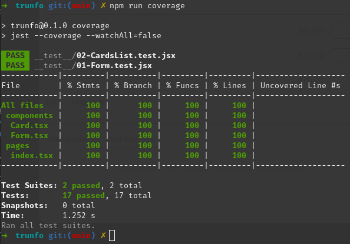

# Trunfo card game 🃏

Trunfo é um projeto desenvolvido por mim Guilherme Artigas, com tema sugerido pela Trybe, porém, eu apliquei reformulações na implementação original, utilizando o Framework NextJS, ESlint para padronização de código e Jest com RTL para cobertura de testes, todos configurados por mim.

A estilização foi feita com a biblioteca Tailwind, com um protótipo disponibilizado através do Figma.

Aqui eu apliquei conhecimentos de manipulação de estados em React e criação e estilização de campos e inputs de formularios com TypeScript.

<details>
  <summary>Saiba mais sobre Trunfo</summary>

  <h2 style="text-align: center">Trunfo</h2>

  O Super Trunfo é um jogo de cartas que ficou muito popular no Brasil entre as décadas de 80 e 90, mas que faz bastante sucesso até hoje. Suas regras são bastante simples, por isso ele é considerado um jogo fácil de jogar. Apesar de ter regras simples, cada baralho de Super Trunfo pode ter um tema diferente, o que o torna um jogo bastante divertido.

  Originalmente, o jogo de Super Trunfo é formado por um baralho de 32 cartas. Cada carta representa um item relacionado ao tema do jogo. Em cada carta também existe uma lista com características daquele item e cada característica possui um valor numérico.

  Para começar o jogo, as cartas devem ser embaralhadas e divididas igualmente para cada participante. Em cada rodada cada pessoa pega somente a primeira carta do seu monte. Na primeira rodada uma pessoa escolhe qual característica quer comparar com as cartas das outras pessoas que estão jogando. Ganha quem tiver o maior número nessa característica. A pessoa que ganhou a rodada recebe as cartas das outras pessoas e escolhe qual característica quer comparar na próxima rodada. O jogo termina quando alguma pessoa tiver todas as cartas do baralho.

  Em cada baralho existe uma (e somente uma) carta Super Trunfo. Essa carta ganha de todas as outras cartas do baralho, independentemente dos valores das características.

  O jogo de Super Trunfo pode ser feito com praticamente qualquer tema, mas tradicionalmente os mais comuns são: carros, países, cidades ou animais.
</details>

<details>
  <summary>Cartas sugeridas</summary>

  Voce pode cadastrar as cartas que quiser, porém, se estiver sem ideias ou caso queira ver o funcionamento, essas são as cartas sugeridas.

  > **Lembrando que temos regras de negócio, todas as descritas abaixo precisam ser atendidas para que o botão de salvar cartas seja habilidato:**
  
  - Os campos Nome, Descrição, Imagem e Raridade devem conter alguma informação (ou seja, os inputs não podem estar vazios).

  - A soma dos valores dos 3 atributos (attr1-input, attr2-input e attr3-input) não pode ultrapassar o valor 210.

  - Cada um dos três atributos pode ter no máximo 90 pontos cada.

  - Os atributos não podem receber valores negativos.

  ```JSON
  [
    {
    "cardName": "Bulbasaur",
    "cardDescription": "Há uma semente de planta em suas costas desde o dia em que este Pokémon nasceu. A semente cresce lentamente.",
    "attr1": "25",
    "attr2": "10",
    "attr3": "90",
    "cardImage": "https://assets.pokemon.com/assets/cms2/img/pokedex/full/001.png",
    "cardRare": "raro",
    "cardTrunfo": false
    },
    {
      "cardName": "Charmander",
      "cardDescription": "Tem preferência por coisas quentes. Quando chove, diz-se que o vapor jorra da ponta de sua cauda.",
      "attr1": "80",
      "attr2": "50",
      "attr3": "70",
      "cardImage": "https://assets.pokemon.com/assets/cms2/img/pokedex/full/004.png",
      "cardRare": "muito raro",
      "cardTrunfo": true
    },
    {
      "cardName": "Squirtle",
      "cardDescription": "Quando retrai seu longo pescoço em sua concha, esguicha água com força vigorosa.",
      "attr1": "65",
      "attr2": "60",
      "attr3": "85",
      "cardImage": "https://assets.pokemon.com/assets/cms2/img/pokedex/full/007.png",
      "cardRare": "muito raro",
      "cardTrunfo": false
    },
    {
      "cardName": "Pikachu",
      "cardDescription": "Quando está com raiva, descarrega imediatamente a energia armazenada nas bolsas de suas bochechas.",
      "attr1": "60",
      "attr2": "70",
      "attr3": "50",
      "cardImage": "https://assets.pokemon.com/assets/cms2/img/pokedex/full/025.png",
      "cardRare": "normal",
      "cardTrunfo": false
    },
    {
      "cardName": "Gengar",
      "cardDescription": "Para roubar a vida de seu alvo, ele se esconde na sombra da presa e silenciosamente espera por uma oportunidade.",
      "attr1": "70",
      "attr2": "75",
      "attr3": "60",
      "cardImage": "https://assets.pokemon.com/assets/cms2/img/pokedex/full/094.png",
      "cardRare": "raro",
      "cardTrunfo": false
    }
  ]
  ```
</details>

## Tecnologias utilizadas


<details>
  <summary>Cobertura de Testes:</summary>

  
</details>

### Como acessar...

Link: https://trunfo-henna.vercel.app/
